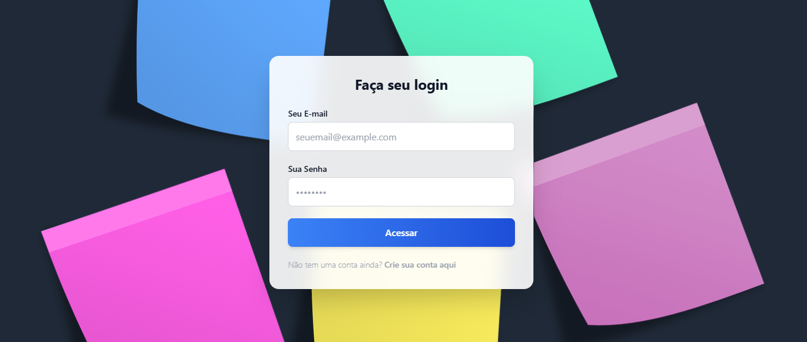
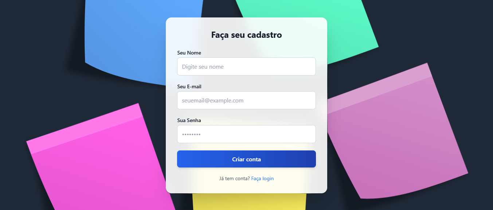
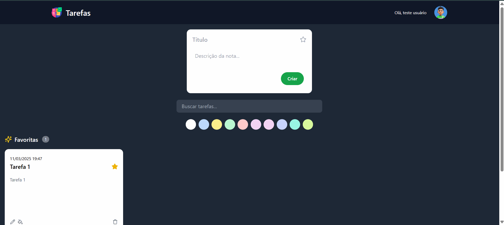

## Clonar repositórios
git clone https://github.com/ricardochomicz/task-api.git
git clone https://github.com/ricardochomicz/task-app.git

# API
## Acessar pasta aplicação, criar .env e variáveis de ambiente
```bash
cd task-api
cp .env.example .env

DB_CONNECTION=mysql
DB_HOST=db
DB_PORT=3306
DB_DATABASE=taskdb
DB_USERNAME=user
DB_PASSWORD=pass
```

## Construir a imagem e rodar o container
```bash
docker-compose up -d
docker exec -it task-api bash
composer install
php artisan:key generate
php artisan migrate
```


## Construir a imagem e rodar o container
```bash
docker build -t task-app .
docker run -p 80:80 task-app
```	
 
# APP
## Acessar pasta aplicação (local)
```bash
cd task-app
npm install --legacy-peer-deps
npm start
``` 

## Construir a imagem e rodar o container
```bash
cd task-app
docker build -t task-app .
docker run -p 3000:80 task-app
```

## Acessar aplicação
[http://localhost](http://localhost)


### Utilizar o sistema
Assista o vídeo abaixo e veja como utilizar o sistema:
[Assistir](https://youtu.be/4P6oRjyOpao)

### Telas do sistema





